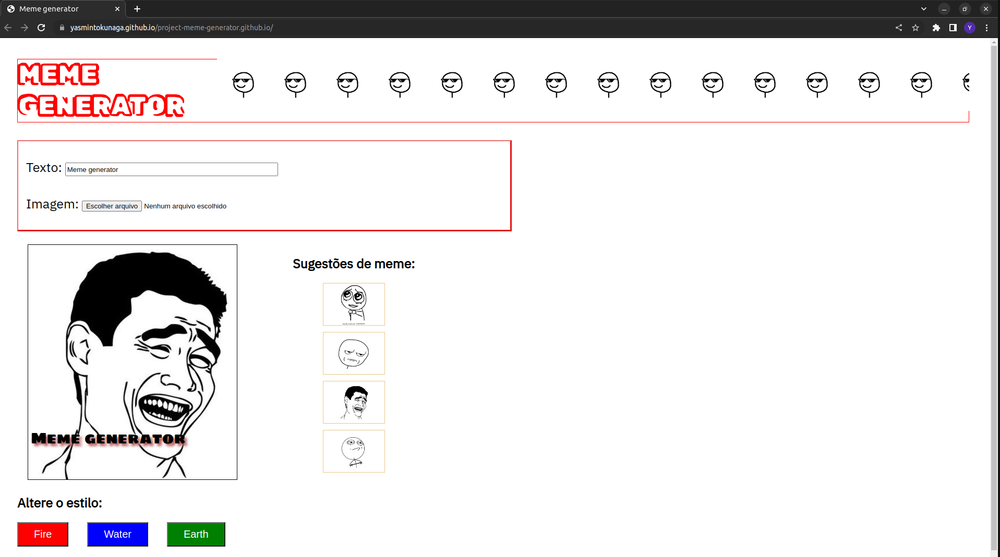

# Projeto Meme Generator

Projeto realizado durante o curso de Desenvolvimento Web na Trybe em Dezembro, 2022.

# Conhecimentos técnicos utilizados: 

* HTML, 
* CSS, 
* JavaScript (DOM, seletores, eventos).

# Objetivo:

Construir uma página de geração de memes.

# Requisitos:

* Incluir um input de texto
* Incluir um input de imagem carregada do computador
* Incluir um container com a pré-visualização da imagem
* Disponibilizar sugestões de imagens para memes 
* Incluir botões para alterar o estilo do meme (o tipo e cor da borda).

# Resultado:

